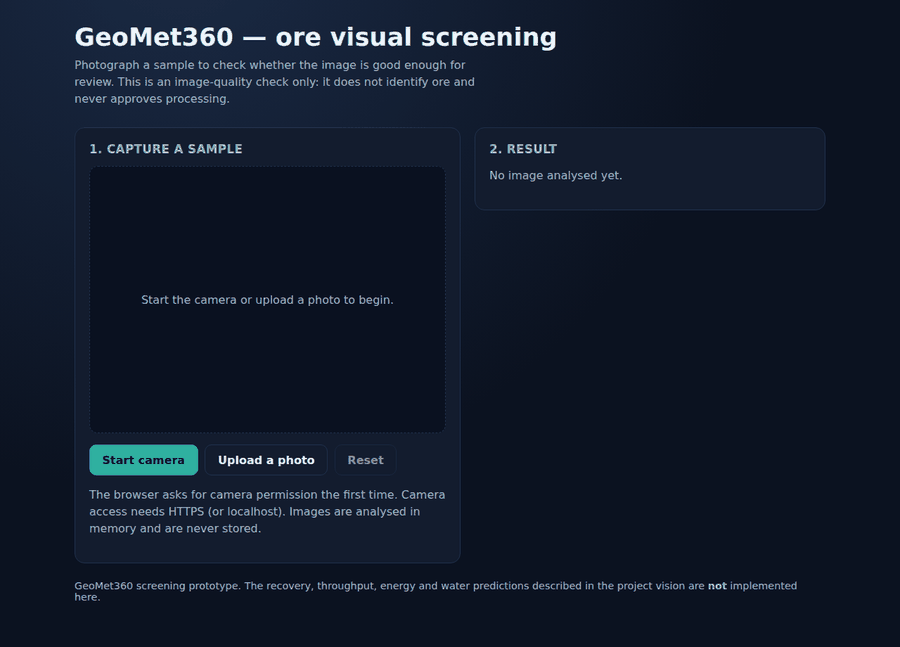
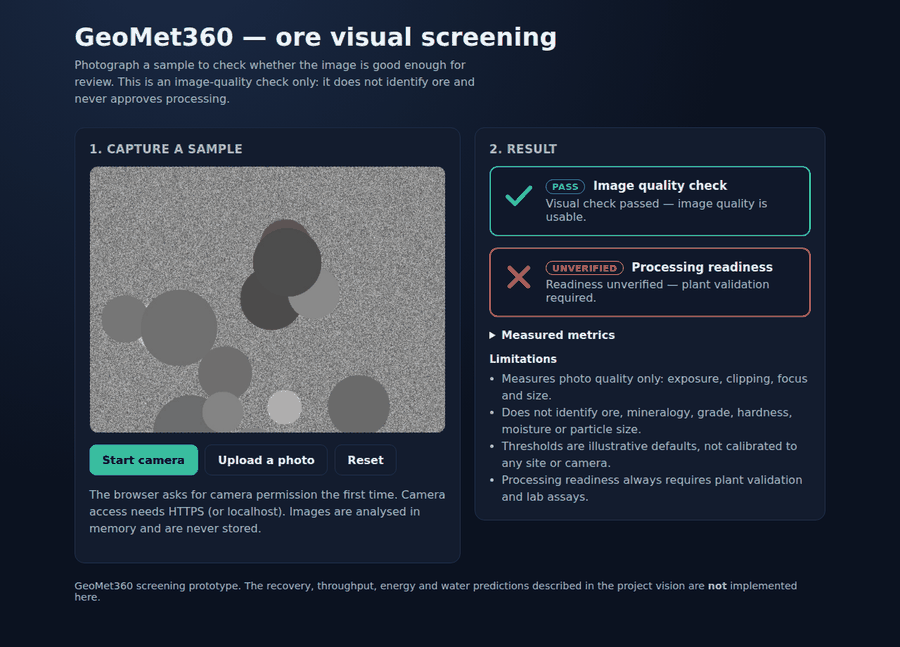
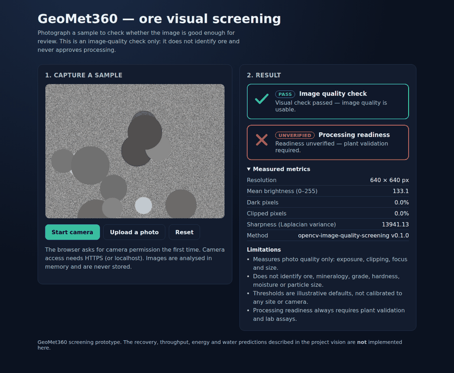
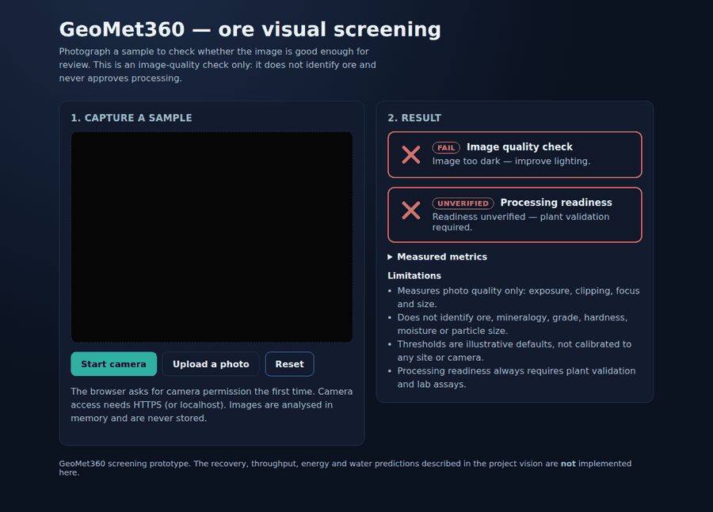
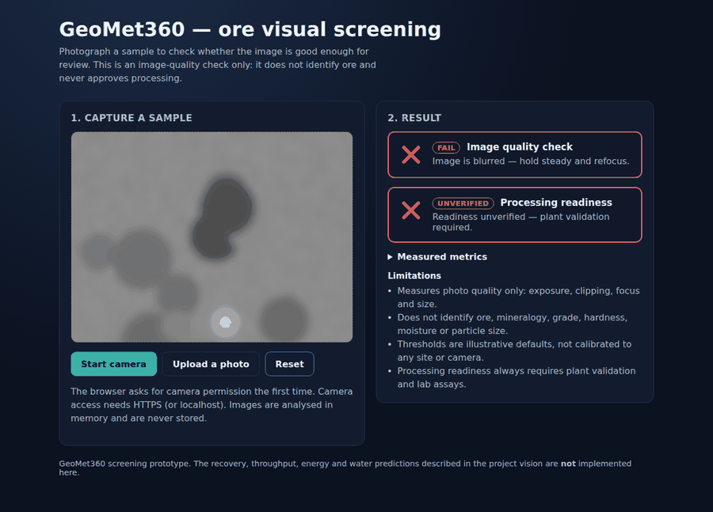
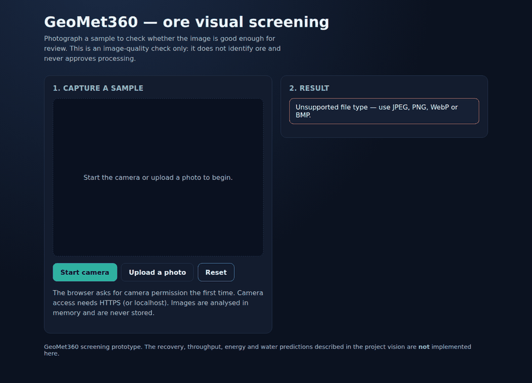
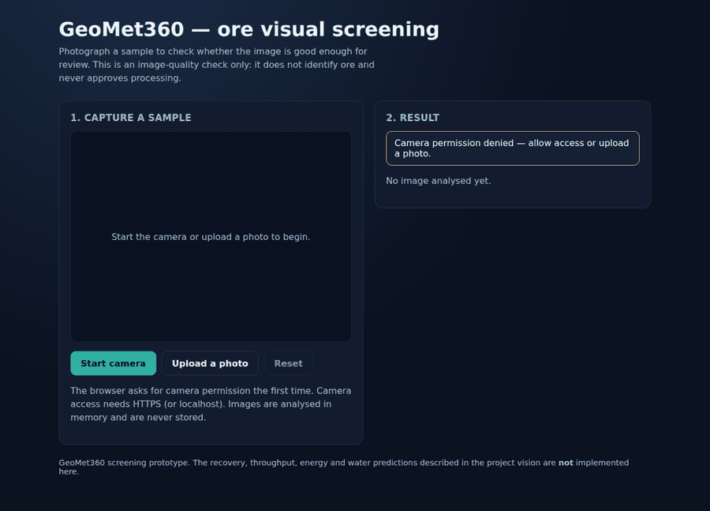
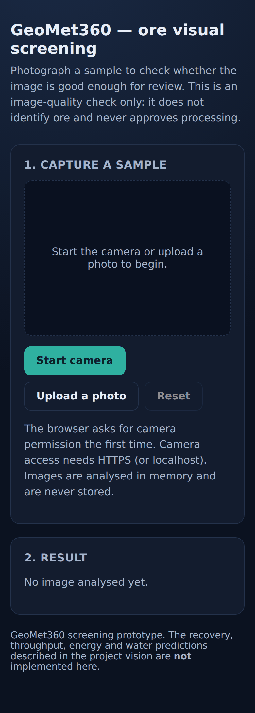

# GeoMet360

**Ore-to-Impact intelligence — visual screening prototype**

GeoMet360 is a geometallurgical decision-intelligence concept: connect ore
characteristics to what happens when that material reaches the processing
plant. This repository contains the **first working slice** of that vision — a
camera-based *visual screening* web app — plus an honest statement of what it
does and does not do.

---

## What this app actually does

1. You start the camera (or upload a photo) of a sample.
2. The browser sends the image to a Python/OpenCV backend.
3. The backend measures **photographic quality only** — resolution, mean
   brightness, the fraction of near-black and blown-out pixels, and focus
   (variance of the Laplacian).
4. You get:
   - a **green tick** ✅ *Visual check passed — image quality is usable*, or a
     **red cross** ❌ with one short, actionable reason such as
     *"Image too dark — improve lighting."*;
   - a **separate** red cross for **processing readiness**:
     *"Readiness unverified — plant validation required."*

Every verdict is conveyed by an icon **and** a text label, never by colour
alone.

## What this app does **not** do

There is **no trained ore model, no labelled dataset, no validated plant rules
and no camera calibration** in this repository. Therefore the app never infers:

- whether the photographed object is ore at all;
- mineralogy, grade, hardness or moisture;
- real particle sizes;
- recovery, throughput, energy or water impact.

A sharp, well-lit photograph proves only that the *photograph* is usable. The
processing-readiness answer is **fail-closed**: it stays `unverified` for every
image, including images that pass the quality check. The
`GEOMET360_READINESS_POLICY_VALIDATED` switch exists purely as a seam for a
future, independently validated classifier and plant policy — enabling it
without supplying those components raises `NotImplementedError` rather than
inventing an approval.

The recovery/throughput/energy/water predictions described in the project
vision below are **not implemented**.

---

## Preview

Screenshots of the running app (captured from the real frontend talking to the
real backend). The sample images used are **synthetic test patterns generated
with NumPy/OpenCV**, not photographs of real ore.

| Starting state | Quality check passed |
| --- | --- |
|  |  |

Note that even when the image-quality check passes, processing readiness still
reports **Unverified — plant validation required**.

| Measured metrics | Too dark |
| --- | --- |
|  |  |

| Blurred | Unsupported file |
| --- | --- |
|  |  |

| Camera permission denied | Mobile layout |
| --- | --- |
|  |  |

## Repository layout

```
backend/           FastAPI + OpenCV screening service
  app/
    config.py      Environment-driven settings and illustrative thresholds
    imaging.py     Untrusted-byte validation and safe decoding
    analysis.py    Deterministic metrics, quality verdict, fail-closed readiness
    schemas.py     Typed request/response models
    main.py        API endpoints, CORS, body-size limits
  tests/           pytest suite (synthetic images only)
frontend/          React + TypeScript + Vite single-page app
  src/
    api.ts         Typed API client
    useCamera.ts   Camera lifecycle, permission errors, track cleanup
    Verdict.tsx    Accessible tick/cross component
    App.tsx        Capture / upload / reset / result UI
    test/          Vitest + Testing Library suite
.github/workflows/ci.yml  Backend tests, frontend tests, typecheck, build
docker-compose.yml        Optional one-command local run
```

---

## Running it locally

### Requirements

Python 3.11+ and Node.js 20+. No paid APIs, accounts or credentials.

### 1. Backend

```bash
cd backend
python3 -m venv .venv
source .venv/bin/activate          # Windows: .venv\Scripts\activate
pip install -r requirements-dev.txt
cp .env.example .env               # optional; defaults work as-is
uvicorn app.main:app --reload --port 8000
```

Check it is alive: <http://127.0.0.1:8000/api/health>
Interactive API docs: <http://127.0.0.1:8000/docs>

### 2. Frontend

```bash
cd frontend
npm install
cp .env.example .env               # optional; defaults work as-is
npm run dev
```

Open <http://localhost:5173>. The dev server proxies `/api/*` to
`http://127.0.0.1:8000`, so no CORS configuration is needed in development.

### Optional: Docker Compose

```bash
docker compose up --build
```

Frontend on <http://localhost:5173>, backend on <http://localhost:8000>.

### Production note: cameras need HTTPS

`navigator.mediaDevices.getUserMedia` is only available in a **secure
context**. That means `localhost` during development, and a real **HTTPS**
origin in production. Served over plain HTTP, the app shows
*"Camera needs HTTPS or localhost — upload a photo instead."* and the upload
fallback remains fully functional.

For a production deployment, build the frontend (`npm run build`), serve
`frontend/dist` from your HTTPS host, set `VITE_API_BASE_URL` to the backend's
public URL at build time, and add that frontend origin to
`GEOMET360_ALLOWED_ORIGINS`.

---

## API

| Method | Path | Purpose |
| --- | --- | --- |
| `GET` | `/api/health` | Liveness, method version, upload limits, readiness-policy flag. |
| `POST` | `/api/analyze` | Multipart `image` field. Returns the typed screening result. |

Example response:

```json
{
  "visual_status": "pass",
  "visual_reason": "Visual check passed — image quality is usable.",
  "readiness_status": "unverified",
  "readiness_reason": "Readiness unverified — plant validation required.",
  "metrics": {
    "width": 480, "height": 480, "mean_brightness": 95.0,
    "dark_fraction": 0.0, "clipped_fraction": 0.0, "sharpness": 3287.4
  },
  "thresholds": { "min_sharpness": 60.0, "...": 0 },
  "limitations": ["Measures photo quality only: exposure, clipping, focus and size."],
  "image_format": "jpeg",
  "method": "opencv-image-quality-screening",
  "method_version": "0.1.0"
}
```

---

## Tests and checks

```bash
# Backend (33 tests)
cd backend && pytest

# Frontend (16 tests), TypeScript check + production build, lint
cd frontend && npm test && npm run build && npm run lint
```

The backend tests generate synthetic sharp / dark / over-exposed / blurred /
shadowed / clipped images with NumPy and OpenCV and assert the exact verdicts,
plus corrupt, empty, non-image, oversized-byte and oversized-dimension inputs,
forged headers, CORS behaviour and the default fail-closed readiness. The
frontend tests cover the tick and cross rendering, the short reasons, upload
validation, loading and error states, concurrent-submission blocking, object
URL release, camera-permission denial and media-track cleanup using a mocked
`getUserMedia`.

Synthetic images exist only inside the test suite. They are clearly labelled as
generated patterns, are never presented in the UI as real samples, and cannot
produce a processing approval, because readiness always fails closed.

**Not tested:** no physical camera hardware was exercised, and no scientific or
metallurgical validation of any kind has been performed.

### Manual smoke test

1. Start the backend and frontend as above.
2. Open <http://localhost:5173>, click **Start camera** and allow the
   permission prompt. On a phone the rear camera is preferred.
3. Click **Capture and analyse** in good light → expect a green tick for image
   quality and a red cross for processing readiness.
4. Cover the lens or dim the room and capture again → expect a red cross with
   *"Image too dark — improve lighting."*
5. Click **Stop camera** → the preview stops and the device camera indicator
   turns off.
6. Click **Upload a photo** and pick a blurred JPEG → expect a red cross with
   the focus reason.
7. Upload a `.txt` file renamed to `.png` → expect
   *"Unsupported file type…"* (the backend also rejects it on its real bytes).
8. Stop the backend and analyse again → expect
   *"Cannot reach the analysis service — check it is running."*
9. Click **Reset** → the preview and result clear.

---

## Configuring the thresholds

All thresholds are **illustrative defaults**, chosen to be conservative for
generic phone photos. They are **not calibrated** to any site, camera, lighting
rig or ore body. Override them with environment variables (see
`backend/.env.example`):

| Variable | Default | Meaning |
| --- | --- | --- |
| `GEOMET360_MIN_MEAN_BRIGHTNESS` | `45` | Reject frames darker than this mean grey level (0–255). |
| `GEOMET360_MAX_MEAN_BRIGHTNESS` | `215` | Reject frames brighter than this mean grey level. |
| `GEOMET360_MAX_DARK_FRACTION` | `0.55` | Max fraction of pixels at ≤ 25 grey level. |
| `GEOMET360_MAX_CLIPPED_FRACTION` | `0.25` | Max fraction of pixels at ≥ 250 grey level. |
| `GEOMET360_MIN_SHARPNESS` | `60` | Min variance of the Laplacian (focus proxy). |
| `GEOMET360_MAX_UPLOAD_BYTES` | `8000000` | Max request body for an upload. |
| `GEOMET360_MAX_IMAGE_PIXELS` | `40000000` | Max decoded pixel count (decompression-bomb guard). |
| `GEOMET360_MAX_IMAGE_DIMENSION` | `10000` | Max width or height. |
| `GEOMET360_MIN_IMAGE_DIMENSION` | `64` | Min width or height. |
| `GEOMET360_ALLOWED_ORIGINS` | localhost:5173 | JSON list of allowed browser origins. |
| `GEOMET360_READINESS_POLICY_VALIDATED` | `false` | Fail-closed readiness switch. Leave `false`. |

The upload limits are mirrored in `frontend/src/api.ts`; change both together.

Any image feature beyond these measurements would be an **uncalibrated visual
proxy** and is deliberately not reported.

## Privacy and security behaviour

- Images are processed in memory and **never written to disk or a database**.
- **No raw image bytes are logged**, and no third-party service is contacted.
- Uploads are validated by **actually decoding** them; the browser-declared
  MIME type and file extension are not trusted.
- Request bytes, header-declared dimensions and decoded pixel counts are all
  bounded **before** large allocations, defending against decompression bombs.
- Errors returned to the browser are short and sanitised; no stack traces or
  internal paths are exposed.
- CORS is restricted to an explicit configured origin list.
- The UI renders text only — no `dangerouslySetInnerHTML`, no HTML injection.

---

## Next steps toward real geometallurgical intelligence

To move beyond image-quality screening, the following work is required — none
of it can be shortcut by tuning the current heuristics:

1. **Collect site-specific labelled images**: photograph samples at the
   conveyor/stockpile under controlled, documented lighting, with a scale
   reference and a fixed camera geometry.
2. **Pair images with ground truth**: lab assays, mineralogy (e.g. QEMSCAN),
   comminution indices and moisture for the same material.
3. **Calibrate the camera** (colour chart, distance and scale) so pixel
   measurements map to physical units.
4. **Connect plant data**: historical throughput, recovery and energy/water
   records linked to the sampled material.
5. **Train and independently validate** an ore-identification model and a
   plant-specific readiness policy, with held-out test sets and documented
   error rates, before any readiness verdict is enabled.
6. **Only then** replace the fail-closed seam in
   `backend/app/analysis.py::assess_readiness` with the validated policy.

---

## Project vision (unchanged)

GeoMet360 is an AI-powered geometallurgical decision-intelligence solution
designed to help mining teams understand how ore may perform before it reaches
the processing plant, around one question:

> "What will happen when this ore reaches the plant?"

### The challenge

Ore entering a processing plant is not uniform. Differences in mineralogy and
ore characteristics influence how material responds during processing. Mining
and processing teams need a better way to connect what is known about the ore
with what may happen once that material reaches the plant.

### The intended solution

GeoMet360 aims to bring together mineralogical data, ore characteristics,
historical processing responses, predictive modelling, agentic AI and mining
domain expertise to anticipate:

- Recovery
- Throughput

and, longer term, potential impacts on energy consumption, water usage and
sustainability.

### Ore-to-Impact intelligence

```
Ore characteristics → Mineralogy → Historical processing response
→ Predictive modelling → Agentic AI → Recovery + throughput
→ Potential energy, water and sustainability impact
```

### Example questions it is designed around

- What will happen when this ore reaches the plant?
- What recovery could be expected from this ore?
- How could these ore characteristics affect throughput?
- What does the historical processing response indicate?
- What potential energy or water impacts should be considered?
- What sustainability impacts could be associated with this ore?

> **Status:** the vision above describes the intended product. The code in this
> repository implements the camera capture and image-quality screening layer
> only.
